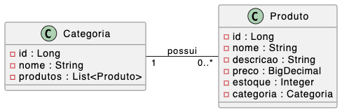

# Aula 02 — Modelagem de dados e persistência em banco

## Objetivo

Modelar as entidades do sistema (`Categoria` e `Produto`), mapear o relacionamento entre elas e criar os repositórios JPA.



## Banco de dados em memória

H2 é um banco de dados em memória que será utilizado para persistir os dados da aplicação. Ele é útil para testes e desenvolvimento, pois não requer configuração de um banco externo.

Maven dependency, alterar o `pom.xml`:

```xml
<dependency>
    <groupId>com.h2database</groupId>
    <artifactId>h2</artifactId>
    <scope>runtime</scope>
</dependency>
```

**Arquivo:** `src/main/resources/application.properties`:

```bash
# H2
spring.datasource.url=jdbc:h2:mem:ecommerce
spring.datasource.username=sa
spring.datasource.password=
spring.datasource.driver-class-name=org.h2.Driver

# JPA / Hibernate
spring.jpa.hibernate.ddl-auto=create-drop
spring.jpa.show-sql=true

# H2 Console
spring.h2.console.enabled=true
spring.h2.console.path=/h2-console
```

### Primeiro experimento:

#### PARTE 1 - Criando entidade e camada de repository

**Arquivo:** `src/main/java/br/unisinos/ecommerce/entity/Produto.java`

``` java
package br.unisinos.ecommerce.entity;

import java.math.BigDecimal;

import jakarta.persistence.Entity;
import jakarta.persistence.GeneratedValue;
import jakarta.persistence.GenerationType;
import jakarta.persistence.Id;
import lombok.AllArgsConstructor;
import lombok.Builder;
import lombok.Getter;
import lombok.NoArgsConstructor;
import lombok.Setter;

@Entity
@Getter
@Setter
@Builder
@NoArgsConstructor
@AllArgsConstructor
public class Produto {

    @Id
    @GeneratedValue(strategy = GenerationType.IDENTITY)
    private Long id;

    private String nome;

    private BigDecimal preco;
}
```

**Arquivo:** `repository/ProdutoRepository.java`

``` java
package br.unisinos.ecommerce.repository;

import org.springframework.data.jpa.repository.JpaRepository;

import br.unisinos.ecommerce.entity.Produto;
@Repository
public interface ProdutoRepository extends JpaRepository<Produto, Long> {

}
```

#### PARTE 2 - executando

Executando código depois que o Spring inicia

Para realizar uma demonstração de persistência, podemos utilizar
`CommandLineRunner`.

``` java
package br.unisinos.ecommerce;

import java.math.BigDecimal;

import org.springframework.boot.CommandLineRunner;
import org.springframework.boot.SpringApplication;
import org.springframework.boot.autoconfigure.SpringBootApplication;
import org.springframework.context.annotation.Bean;

import br.unisinos.ecommerce.entity.Produto;
import br.unisinos.ecommerce.repository.ProdutoRepository;

@SpringBootApplication
public class EcommerceApplication {

    public static void main(String[] args) {
        SpringApplication.run(EcommerceApplication.class, args);
    }

    @Bean
    CommandLineRunner initDatabase(ProdutoRepository produtoRepository) {
        return args -> {

            Produto produto = Produto.builder()
                    .nome("Notebook")
                    .preco(new BigDecimal("3500"))
                    .build();

            produtoRepository.save(produto);
        };
    }
}
```

### Entidade `Categoria`

**Arquivo:** `src/main/java/br/unisinos/ecommerce/entity/Categoria.java`

```java
@Entity
@Table(name = "categoria")
@Getter @Setter @NoArgsConstructor @AllArgsConstructor @Builder
public class Categoria {

    @Id
    @GeneratedValue(strategy = GenerationType.IDENTITY)
    private Long id;

    @NotBlank(message = "O nome da categoria é obrigatório")
    @Column(nullable = false, length = 100)
    private String nome;

    @OneToMany(mappedBy = "categoria")
    @JsonManagedReference
    private List<Produto> produtos;
}
```

### Entidade `Produto`

**Arquivo:** `src/main/java/br/unisinos/ecommerce/entity/Produto.java`

```java
@Entity
@Table(name = "produto")
@Getter @Setter @NoArgsConstructor @AllArgsConstructor @Builder
public class Produto {

    @Id
    @GeneratedValue(strategy = GenerationType.IDENTITY)
    private Long id;

    @NotBlank
    @Column(nullable = false, length = 100)
    private String nome;

    @Size(max = 500)
    private String descricao;

    @NotNull
    @DecimalMin(value = "0.0", inclusive = false)
    @Column(nullable = false, precision = 10, scale = 2)
    private BigDecimal preco;

    @NotNull
    @Column(nullable = false)
    private Integer estoque;

    @ManyToOne
    @JoinColumn(name = "id_categoria", foreignKey = @ForeignKey(name = "fk_produto_categoria"))
    @JsonBackReference
    private Categoria categoria;
}
```

### Repositórios

**Arquivo:** `src/main/java/br/unisinos/ecommerce/repository/CategoriaRepository.java`
```java
@Repository
public interface CategoriaRepository extends JpaRepository<Categoria, Long> { }
```

**Arquivo:** `src/main/java/br/unisinos/ecommerce/repository/ProdutoRepository.java`
``` java
@Repository
public interface ProdutoRepository extends JpaRepository<Produto, Long> {
}
```

`JpaRepository<T, ID>` já fornece: `save()`, `findById()`, `findAll()`, `deleteById()`, entre outros.

## O que os alunos precisam fazer

1. Criar o pacote `entity` dentro de `br.unisinos.ecommerce`
2. Criar a classe `Categoria` com os campos e anotações mostrados
3. Criar a classe `Produto` com relacionamento `@ManyToOne` para `Categoria`
4. Criar o pacote `repository` e as interfaces `CategoriaRepository` e `ProdutoRepository`
5. Subir a aplicação e verificar no banco que as tabelas `categoria` e `produto` foram criadas

## Conceitos abordados

| Anotação | Significado |
|---|---|
| `@Entity` | Marca a classe como tabela JPA |
| `@Table(name=)` | Define o nome da tabela |
| `@Id` + `@GeneratedValue` | Chave primária auto-incrementada |
| `@Column` | Customiza a coluna (nullable, length) |
| `@ManyToOne` / `@OneToMany` | Relacionamento bidirecional |
| `@JsonManagedReference` / `@JsonBackReference` | Evita recursão infinita na serialização JSON |
| Lombok `@Builder` | Permite construção fluente de objetos |

### Código desenvolvido em aula 

> Disponibilizado no Moodle da disciplina
